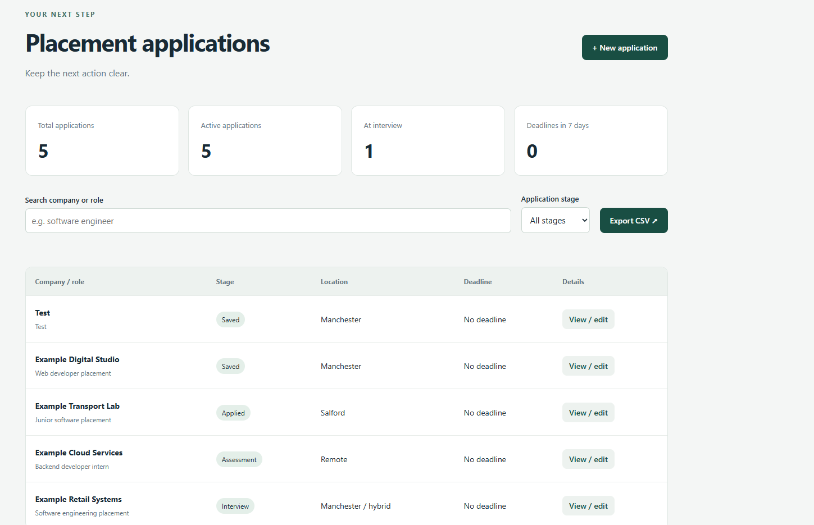

# Placement Application Tracker

A local application tracker for students applying to placements and internships. Save opportunities, record the next action and see applications move through assessment, interview and offer stages.

## Run on Windows

Requires Python 3.12 or newer. No packages, API keys or account registration needed.

Open this extracted project folder in VS Code, then run in its terminal:

```powershell
py server.py
```

Open **http://127.0.0.1:8001**. This uses a different port from the delivery route optimiser, so both can run together. Stop the server with Ctrl+C.

For fictional demo entries, run this once before starting the server:

```powershell
py seed_demo.py
```

The seed script refuses to add data to a nonempty database. Demo companies are fictional. On macOS/Linux, use `python3` in place of `py`.

## Features

- Create and edit opportunities with company, role, location and job link.
- Track Saved, Applied, Assessment, Interview, Offer, Rejected and Withdrawn stages.
- Record notes, deadlines and stage-change history.
- Search by company or role and filter by stage.
- Display active applications, interviews and upcoming deadlines.
- Export applications as CSV with formula-injection mitigation.
- Preserve data between restarts in a local SQLite database.
- Reject stale updates using an application revision number.

## Architecture and decisions

`store.py` owns validation, persistence, optimistic concurrency and CSV generation. `server.py` maps requests to this layer; the interface uses plain HTML, CSS and JavaScript. Keeping the domain logic separate makes it testable without a browser or server.

SQLite suits a single-user local tool: setup is small and database transactions keep an application update and its stage-history event together. Each HTTP request gets its own database connection rather than sharing a connection across threads. An update includes its last-read revision; the SQL update only succeeds if that revision still matches. A competing update receives HTTP 409 and must reload.

Stage history records stage changes, not a full audit log of every field edit. Notes are plain text and rendered with DOM text operations, avoiding HTML interpolation. Job URLs are limited to HTTP(S). Mutation requests require a random session token and a loopback Host header. The server sends a content security policy and does not enable CORS.

## Tests

```powershell
py -m unittest discover -v
```

Tests cover persistence across connections, stale updates, atomic history, validation, SQL payloads, CSV quoting, formula mitigation and HTTP response behaviour. GitHub Actions runs the suite on push and pull request when this project is uploaded at the repository root.

## Data and limits

The database is `applications.db`, next to `server.py`. Back up personal data before making changes. Database files are excluded by `.gitignore`; do not upload them through GitHub's manual upload interface. Data is local but not encrypted. A CSV export is a report, not a full database backup: it excludes revision numbers and history and there is no import feature yet.

This is a single-user local demo. It has no login, multi-user separation, email reminders or public hosting configuration. Do not expose the development server to the internet. Browser interaction and accessibility should receive further manual testing. Tests do not establish production security or performance.

The deadline count includes today through seven days ahead, inclusive, and excludes terminal stages. Offer, Rejected and Withdrawn are treated as terminal for dashboard counts. Stage changes can go backwards to support corrections.

## Useful extensions

1. Add a follow-up date separate from the application deadline.
2. Add JSON backup and restore including stage history, with an explicit preview before import.
3. Add an archive view and reversible archive action.
4. Test keyboard-only use and improve focus handling after saves.
5. Add monthly application-to-interview conversion metrics and document denominator choices.

## Provenance

The initial implementation was built with AI assistance. Personal usage, independently understood changes and measured results should be described accurately. No real user adoption, commercial deployment or interview outcomes are claimed.
## Demo


